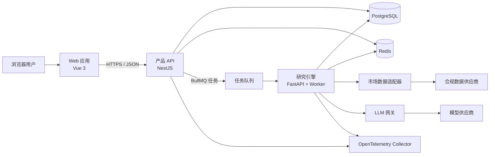
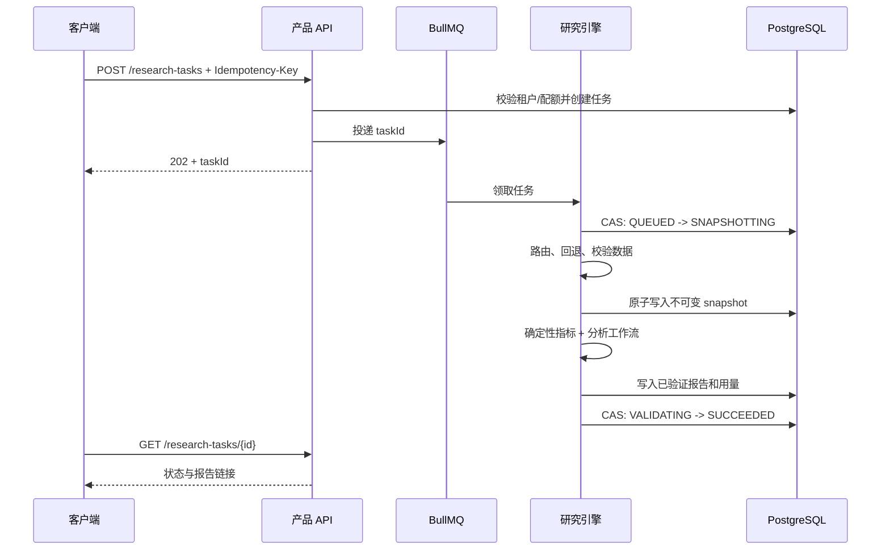

# 系统架构

状态：提议稿  
版本：0.1  
最后更新：2026-08-09

## 1. 架构目标

Equity Atlas 是中文优先、多租户、多市场的股票研究系统。架构首先保证：

- 同一次研究的所有分析步骤只读取同一份不可变上下文快照；
- 行情和事实数据在字段级保留来源、时点、新鲜度和质量；
- 外部数据或模型失败时可降级、可重试、可解释，不静默制造完整结果；
- 历史报告可由快照、工作流版本、提示词版本和模型信息复现；
- 租户数据从 API、任务、缓存到数据库全链路隔离；
- 数值计算由确定性代码完成，LLM 只解释已有证据；
- MVP 保持可运营的简单度，同时允许后续按负载拆分。

系统明确不接收券商密码、不持有交易凭据、不下单、不承诺收益。

## 2. 总体视图

Web 只调用产品 API。身份、观察列表、历史报告和已缓存行情同步返回。研究请求先在 PostgreSQL 创建任务，再投递 BullMQ；研究引擎构建不可变快照、执行分析、验证报告并持久化结果。产品 API 不直接调用市场数据或模型供应商。

## 3. 部署单元

| 单元 | 技术 | MVP 责任 | 可扩展方向 |
| --- | --- | --- | --- |
| Web | Vue 3、TypeScript、Vite、Pinia | 认证、搜索、观察列表、图表、任务与报告 | CDN；只在确有需要时引入 SSR/BFF |
| 产品 API | NestJS、Prisma | 用户、租户、权限、配额、观察列表、任务、报告读取、审计 | 高并发时拆分通知与计费 |
| 研究 API/Worker | Python 3.12、FastAPI、Pydantic | 标识、数据路由、快照、指标、研究、报告校验 | 按市场或工作流拆分 worker 池 |
| PostgreSQL | PostgreSQL 16 | 事实主库、不可变快照、报告、审计 | 只读副本、按时间分区 |
| Redis/BullMQ | Redis 7 | 缓存、限流、短锁、任务投递 | Redis Cluster 或托管服务 |
| 可观测性 | OpenTelemetry | trace、metric、结构化日志关联 | 独立日志和指标后端 |

产品 API 在 MVP 中保持模块化单体，避免过早引入网络边界。研究引擎独立部署，因为它具有不同语言、依赖、资源消耗、失败模式和扩容方式。

## 4. 核心流程

### 4.1 标的搜索与规范化

1. 产品 API 接收用户输入、locale 和可选市场提示。
2. 规范化器生成候选，存在歧义时不得武断选中。
3. 已知标的返回稳定 `instrumentId`；新标的经供应商确认后写入主数据。
4. 所有业务关系只保存 `instrumentId`，ticker 仅用于展示和查询。

稳定 ID 建议为 `<market>_<mic>_<canonical-symbol>` 的小写安全字符形式；一旦分配，不得因展示代码改变而变更。重命名、退市和转板通过别名及有效期表达。

### 4.2 研究任务

关键保证：

- `Idempotency-Key + tenantId` 唯一，避免用户重试产生重复成本；
- 状态迁移使用版本号或 compare-and-set，避免多个 worker 同时完成；
- 快照完整校验后一次写入，写入后禁止更新；
- agent 只接收该 snapshot 的只读内容，不能访问实时数据工具；
- 任务重试复用已成功创建的快照，除非用户显式创建新任务；
- 成功报告必须通过 schema、来源绑定和措辞规则校验。

### 4.3 供应商路由

供应商按能力、市场、许可与优先级配置：

1. 读取能力矩阵与许可策略；
2. 排除熔断、限流或无权使用的供应商；
3. 在总 deadline 内按策略调用；
4. 仅对瞬时错误执行带抖动的指数退避；
5. 保留每个响应，不静默覆盖矛盾字段；
6. 用显式 resolution policy 选主值并记录候选；
7. 返回 partial result、限制说明和健康指标。

错误分类统一为 `INVALID_REQUEST`、`NOT_FOUND`、`AUTH_FAILURE`、`LICENSE_RESTRICTED`、`RATE_LIMITED`、`TIMEOUT`、`UPSTREAM_5XX`、`SCHEMA_DRIFT`、`STALE_DATA`。

## 5. 可信度与可复现性

每个外部字段至少保留：原始值与规范化值、provider、provider record reference、`asOf`、`receivedAt`、延迟标记、质量、新鲜度、resolution policy 和冲突候选。

研究快照保存数据截止点、市场阶段、日历版本、时区解释、来源与质量限制。模型运行记录 provider、model ID、模型参数、prompt version、workflow version、snapshot ID、token/cost、时长和错误分类。提示词版本指向不可变内容哈希。

## 6. 一致性和事务

- 产品 API 持有用户、成员、观察列表和任务创建写权限；研究引擎持有快照、agent run 和报告写权限。
- 跨服务流程使用数据库状态与幂等消费，不使用分布式事务。
- 数据库写入与 BullMQ 投递间使用 transactional outbox。
- 通知、用量聚合等副作用用 inbox 以事件 ID 去重。
- 缓存不是事实来源；缓存失效只影响性能，不影响正确性。

## 7. 安全架构

- 密码使用 Argon2id；refresh token 只保存哈希并轮换，可按 token family 撤销。
- access token 短期有效，包含 subject、tenant、role、session 和 audience。
- 租户表包含 `tenant_id`；仓储层强制 tenant context，生产库增加 PostgreSQL RLS。
- worker 从任务记录解析租户，不信任队列消息内的任意 tenant ID。
- 凭据来自密钥管理服务；日志统一脱敏 token、API key 和持仓敏感字段。
- 管理、导出、权限和保留策略变更写 append-only 审计日志。
- Web 使用严格 CSP；refresh token 若置于 Cookie 中则使用 SameSite 与 CSRF token。

## 8. 可靠性与可观测性

建议首版目标：

| 指标 | 目标 |
| --- | --- |
| 产品 API 月可用性 | 99.5% |
| 非研究同步 API p95 | 500 ms |
| 基础研究完成率（有可用数据时） | 99% |
| 重复任务产生重复计费 | 0 |
| 已完成报告缺少 snapshotId | 0 |

所有服务输出 JSON 日志并携带 `traceId`、`requestId`、`tenantId`（内部 ID 或哈希）、`taskId`、`snapshotId`。健康检查区分 liveness 与 readiness。指标覆盖队列延迟、阶段耗时、供应商错误/熔断、缓存命中、快照质量、模型 token 和成本。

## 9. 时间与市场规则

- 数据库存 `timestamptz` 并统一为 UTC；展示按交易所时区转换。
- 交易日和市场阶段来自可版本化交易所日历，不能只用工作日推算。
- 日本市场显式建模午休；未完成 K 线必须标记。
- 市场规则由 `(market, exchange)` 策略注册表选择，禁止全局套用 A 股概念。
- 历史分析必须提供 `data_cutoff`，验证层拒绝任何 `asOf > data_cutoff` 的数据。

## 10. 演进路线

1. 建立共享契约和市场标识包，锁定跨语言 schema。
2. 完成身份、租户、观察列表和标的主数据。
3. 引入单一合规供应商与 mock provider，完成行情、K 线和 fallback 框架。
4. 建立快照、确定性技术指标、基础研究和结构化报告闭环。
5. 增加新闻、投资论点、通知和组合上下文。
6. 在相同快照边界内增加深度多 agent 工作流。
7. 最后增加严格隔离的回测域；不增加交易执行域。

## 11. 待决策项

- 首批数据供应商及其缓存、展示、衍生和再分发权利；
- 对象存储方案和供应商原始数据允许保留期；
- PostgreSQL RLS 是否在开发环境默认启用；
- LLM 区域、数据保留和零数据训练选项；
- SLO 与成本上限需在真实压测后校准。
