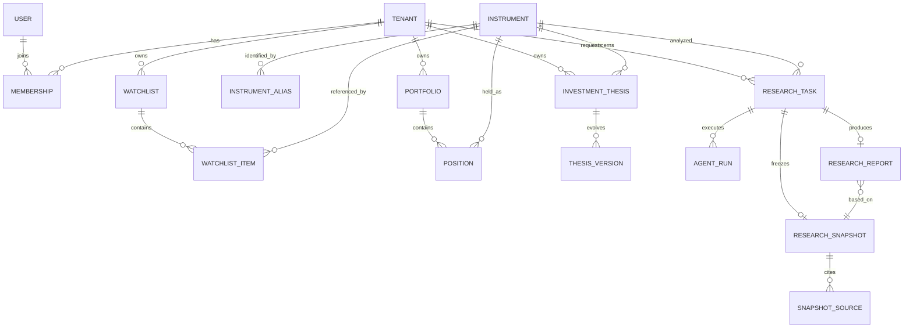

# 数据库实体模型

状态：提议稿  
版本：0.1  
数据库：PostgreSQL 16  
最后更新：2026-08-09

## 1. 建模约定

- 主键使用 UUIDv7（列类型 `uuid`），兼顾全局唯一与索引局部性。
- 所有时点使用 `timestamptz`，写入 UTC；交易日另用交易所本地 `date`。
- 多租户业务表必须包含 `tenant_id`，唯一约束通常以 `tenant_id` 开头。
- 金额、价格、数量、汇率使用 `numeric`，禁止浮点数保存财务值。
- currency 使用 ISO 4217；exchange 使用 ISO 10383 MIC；market 使用受控枚举。
- 可变业务实体包含 `created_at`、`updated_at` 和 `version` 乐观锁字段。
- 审计、快照、报告、用量等不可变事实不软删改。
- JSONB 只承载版本化、异构或原始载荷；核心筛选和关联字段结构化。
- 敏感字段标记数据分类；密钥和 refresh token 不保存明文。

## 2. 高层实体关系



## 3. 身份、租户与权限

### `users`

| 字段 | 类型 | 约束/说明 |
| --- | --- | --- |
| id | uuid | PK |
| email_normalized | citext | UNIQUE，登录标识 |
| display_name | varchar(120) | 非空 |
| locale | varchar(10) | `zh-CN`/`ja-JP`/`en-US` 等 |
| timezone | varchar(64) | IANA timezone |
| status | enum | ACTIVE、LOCKED、DEACTIVATED |
| created_at / updated_at | timestamptz | 非空 |

`user_credentials` 一对一关联 user，保存 password hash、算法、失败次数和锁定截止时间。密码使用 Argon2id。`auth_sessions` 保存 user、tenant、token family、refresh token hash、过期/轮换/撤销时间和设备摘要；旧 refresh token 再使用会撤销整个 token family。

### `tenants` 与 `memberships`

tenant 保存 name、PERSONAL/ORGANIZATION 类型、状态、data region、retention policy。membership 以 `(tenant_id, user_id)` 唯一，首期角色为 OWNER、ADMIN、MEMBER、VIEWER。授权判断集中在 policy 层。

## 4. 标的主数据

### `instruments`

| 字段 | 类型 | 约束/说明 |
| --- | --- | --- |
| id | varchar(96) | PK，稳定内部 instrument ID |
| canonical_symbol | varchar(48) | 交易所规范代码 |
| display_symbol | varchar(48) | 默认展示代码 |
| mic | char(4) | ISO 10383，例如 XTKS |
| market | enum | CN、HK、US、JP、GLOBAL |
| instrument_type | enum | EQUITY、ETF、INDEX |
| currency | char(3) | ISO 4217 |
| timezone | varchar(64) | IANA timezone |
| status | enum | ACTIVE、SUSPENDED、DELISTED、UNKNOWN |
| valid_from / valid_to | date | 标的有效期 |
| provider_verified_at | timestamptz | 最近主数据核验时间 |
| metadata | jsonb | 版本化扩展属性 |

唯一约束 `(mic, canonical_symbol, valid_from)`。显示代码改变不修改 `id`。

`instrument_names` 用 locale、name type、primary flag 和有效期保存日文法定名、中文译名与英文名。`instrument_aliases` 以 normalized alias、market hint、有效期和 priority 建索引；一个输入允许返回多个候选。

`exchange_calendars` 按 `mic + local_date + calendar_version` 唯一，记录开闭市及特殊休市。`exchange_sessions` 分段记录开盘、午休前后和收盘区间；历史研究引用 calendar version。

## 5. 用户研究上下文

### 观察列表和组合

`watchlists` 包含 tenant、名称、描述、排序和软删除时间。`watchlist_items` 唯一 `(tenant_id, watchlist_id, instrument_id)`；冗余 tenant 用于 RLS，并以复合外键阻止跨租户关联。

`portfolios` 保存 tenant、名称、base currency、类型和说明，不建立券商凭据。`positions` 保存数量 `numeric(28,10)`、平均成本、币种、as-of、MANUAL/IMPORT 来源和版本，唯一 `(tenant_id, portfolio_id, instrument_id)`；变化另写不可变 `position_events`。

### 投资论点

`investment_theses` 是稳定聚合根。每次编辑新增不可变 `thesis_versions`，保存论点、持有月数、最大可接受损失（check 0..100）、作者和时间；失效条件使用子表。`thesis_assessments` 关联 report 和确切 thesis version，状态限定为 STRENGTHENED、UNCHANGED、WEAKENED、INVALIDATED、INSUFFICIENT_DATA，并保存证据引用，不改写用户原文。

## 6. 研究任务与幂等

### `research_tasks`

| 字段 | 类型 | 约束/说明 |
| --- | --- | --- |
| id | uuid | PK |
| tenant_id / requested_by | uuid | RLS 键与请求用户 |
| instrument_id | varchar(96) | FK instrument |
| mode | enum | BASIC、DEEP |
| status | enum | 服务边界文档中的状态机 |
| idempotency_key | varchar(128) | 请求去重 |
| request_hash | char(64) | 防相同 key 不同载荷 |
| data_cutoff | timestamptz | 数据时间上界 |
| market_phase | enum | 请求时市场阶段 |
| snapshot_id | uuid | 构建后关联 |
| attempt_count / max_attempts | smallint | 非负 check |
| available_at | timestamptz | 重试时间 |
| error_code / error_detail_redacted | text | 分类且脱敏 |
| version | integer | 状态 CAS |
| created/started/completed_at | timestamptz | 生命周期 |

唯一 `(tenant_id, idempotency_key)`。相同 key 的 `request_hash` 不同则返回冲突。`task_state_transitions` 不可变记录每次迁移。`outbox_events` 与业务事务同写；`inbox_receipts` 以 `(consumer, event_id)` 唯一，实现至少一次投递下的幂等消费。

## 7. 不可变研究快照

### `research_snapshots`

| 字段 | 类型 | 约束/说明 |
| --- | --- | --- |
| id / task_id | uuid | PK；task_id UNIQUE FK |
| tenant_id | uuid | RLS 键 |
| instrument_id | varchar(96) | FK |
| schema_version | varchar(20) | 必填 |
| content_hash | char(64) | canonical JSON SHA-256 |
| analysis_time / data_cutoff | timestamptz | 必填 |
| market_phase | enum | 必填 |
| calendar_version | varchar(40) | 必填 |
| payload | jsonb | 完整版本化快照 |
| quality_score | smallint | check 0..100 |
| quality_level | enum | HIGH、MEDIUM、LOW、INSUFFICIENT |
| created_at | timestamptz | 必填 |

运行角色禁止 UPDATE/DELETE；应用只提供 insert/get。`content_hash` 基于固定字段排序、数字和时间格式的 canonical JSON。

`snapshot_sources` 保存 provider、source type、标题、规范 URL、published/as-of/received 时间、content hash、license policy、quality 和 raw artifact reference。URL 入库前去除凭据。

`snapshot_field_provenance` 以 JSON Pointer 标识字段，保存 selected source、resolution policy、freshness 和 quality；`provenance_candidates` 保存冲突值及未选原因。`provider_requests` 记录 capability、provider、outcome、attempt、latency、rate limit、cache hit 和 trace；参数及响应仅保存脱敏摘要或哈希。

## 8. Agent、模型与报告

`workflow_definitions` 和 `prompt_versions` 均是不可变版本，保存 content hash。`agent_runs` 关联 task、snapshot、workflow、prompt，记录 role、sequence、结构化输出与错误。约束保证 run snapshot 与 task snapshot 一致。

`model_invocations` 保存 provider、model ID、region、参数、请求/响应 hash、token、成本、latency 和 policy flags，不保存 API key；原始 prompt/response 按隐私策略保留。

### `research_reports`

| 字段 | 类型 | 约束/说明 |
| --- | --- | --- |
| id | uuid | PK |
| tenant_id | uuid | RLS 键 |
| task_id / snapshot_id | uuid | task UNIQUE；snapshot 必填 |
| instrument_id | varchar(96) | FK |
| schema/workflow_version | varchar | 必填 |
| rating | enum | POSITIVE、WATCH、NEUTRAL、RISK_INCREASED、AVOID |
| confidence | numeric(5,4) | check 0..1 |
| payload | jsonb | schema 校验后的完整报告 |
| validation_status | enum | VALID、REJECTED |
| content_hash / created_at | char(64) / timestamptz | 必填 |

成功报告 append-only。`report_claims` 拆出时效性陈述；`report_claim_sources` 绑定 snapshot source。验证要求时效事实至少一个来源，且 `source.as_of <= snapshot.data_cutoff`。

## 9. 用量、通知与审计

`usage_events` 是不可变账本，唯一 `(tenant_id, idempotency_key, metric)`；配额采用“预留—结算—释放”。通知投递单独重试，不回滚研究结果。

`audit_logs` append-only 保存 tenant、actor、action、resource、结果、request/trace ID、IP/UA 摘要和脱敏 diff。禁止写入密码、token、API key 或完整持仓导出。

## 10. RLS 与租户隔离

生产环境对 tenant-scoped 表启用并强制 RLS。每个事务设置 transaction-local `app.tenant_id`：

```sql
USING (tenant_id = current_setting('app.tenant_id', true)::uuid)
WITH CHECK (tenant_id = current_setting('app.tenant_id', true)::uuid)
```

连接池不能使用 session-global tenant 设置。后台任务同样逐事务设置。系统运维角色和运行角色分离，应用不能使用表 owner 或绕过 RLS 的角色。

## 11. 索引、分区与保留

- 外键显式建索引；tenant 表常用索引以 `tenant_id` 为首列。
- 任务领取索引 `(status, available_at)`，并为未完成状态建 partial index。
- 报告列表索引 `(tenant_id, instrument_id, created_at desc)`。
- alias 使用规范化列和 trigram 索引支持名称模糊搜索。
- provider request、usage、audit 按月分区；MVP 可先用普通表并监控阈值。
- 删除租户使用可审计异步擦除；供应商数据保留由 `data_license_policies` 驱动。

## 12. 关键数据库约束

1. report 的 task、snapshot、tenant、instrument 必须一致。
2. snapshot 的 `data_cutoff <= analysis_time`。
3. provenance 的 `as_of <= data_cutoff`；未知 as-of 必须显示 limitation，不能伪造。
4. `SUCCEEDED` task 必须关联 snapshot 和 VALID report，并在同一事务完成。
5. snapshot、report、prompt、workflow、usage、audit 禁止原地改内容。
6. 百分比、confidence、quality score 均有范围 check。
7. tenant 子实体用复合 FK 阻止跨租户父子关系。

## 13. Prisma 实现注意事项

Prisma 用于常规 CRUD 和迁移组织；以下需要手写 SQL migration 和真实 PostgreSQL 集成测试：

- RLS policies 与数据库角色权限；
- citext、pg_trgm 扩展；
- append-only 权限或触发器；
- partial/表达式索引；
- deferrable 复合约束和分区；
- outbox 并发领取的 `FOR UPDATE SKIP LOCKED`。

Prisma schema 不是唯一事实来源，关键约束必须由数据库验证。

## 14. 待细化项

- 首批供应商字段映射确定后冻结 snapshot payload v1；
- 明确企业租户是否需要用户级持仓可见性；
- 确定租户删除后的审计和用量最小保留范围；
- TimescaleDB 不默认引入，只在规模和查询证明需要时采用；
- API 设计阶段补齐字段级数据分类及导出/删除行为。
