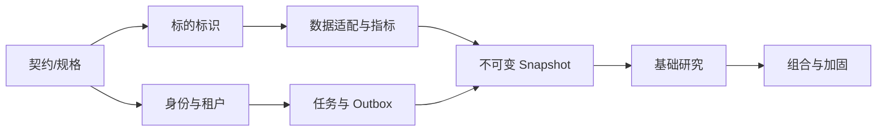

# MVP 实施计划

状态：提议稿  
版本：0.1  
最后更新：2026-08-09

## 1. 交付原则

- 按可演示的纵向切片交付，不长期保留无法运行的大型脚手架分支；
- 先用 mock/synthetic provider 验证正确性，真实 provider 必须通过许可审批；
- 跨语言契约先于服务实现，并由生成类型与契约测试防漂移；
- 每个增量包含目的、变更文件、迁移、测试结果、已知失败和回滚方式；
- 小提交只包含一个清晰意图，禁止顺带格式化或重写无关文件；
- 未满足生产门槛时只声明 development-ready，不宣称生产可用。

## 2. 里程碑

### M0：规格与工程基线

目标：建立所有实现团队共享的事实来源。

交付：12 项前置文档、snapshot/report JSON Schema、monorepo、格式/lint/typecheck/test 命令、CI、环境示例、基础 Docker Compose、ADR 模板和依赖合规基线。

退出条件：新环境按 README 能运行质量门禁；Schema 可被 TypeScript/Python 消费；无 secrets 或未知二进制资产。

### M1：市场标识纵向切片

目标：无需外部网络即可可靠规范化需求列举的市场代码。

交付：

- `packages/market-identifiers` 纯函数核心与版本化规则；
- A 股沪深后缀、港股补零、US ticker、东京 `.T`、指数和 ETF 候选；
- 歧义结果类型、多语言名称接口、MIC/currency/timezone 策略；
- shared contracts、fixture catalog、单元/属性/契约测试；
- product API 搜索端点先接 mock catalog。

退出条件：验收代码全部通过；ticker 不作为业务外键；日本规则不受 A 股策略污染。

### M2：身份、租户与观察列表

目标：完成第一个安全的多租户用户闭环。

交付：NestJS、Prisma、PostgreSQL migrations、Argon2id、JWT rotation、RBAC policy、RLS SQL、观察列表 CRUD、审计基础、OpenAPI 和 Web 登录/列表页面。

退出条件：跨租户负向集成测试通过；token reuse 可撤销 family；并发添加条目不重复；迁移可在空库和升级库运行。

### M3：行情、K 线与指标

目标：建立 provider-independent 数据路径。

交付：Python FastAPI、provider interfaces、mock provider、timeout/retry/circuit breaker、Redis cache、provenance values、日线、交易日历、确定性指标、数据质量评分和图表 API/UI。

退出条件：故障注入验证 fallback/partial；相同 fixture 指标稳定；未完成 bar 和 cutoff 行为测试通过；无权数据由 policy 阻止。

### M4：不可变快照与任务队列

目标：可靠地把一次请求冻结为可复现分析输入。

交付：research task 状态机、outbox/inbox、BullMQ publisher/worker、snapshot builder、canonical hash、append-only 权限、进度查询、取消和重试。

退出条件：重复投递只执行一次；worker 崩溃后恢复；snapshot 无 UPDATE 权限；来源和字段路径完整；历史 cutoff 负向测试通过。

### M5：基础研究与报告

目标：完成 BASIC 模式端到端研究。

交付：LLM gateway、model policy、prompt registry、基础工作流、报告 validator、usage ledger、报告历史/API/UI、模型 mock 和至少一个经审批的可选模型适配器。

退出条件：无模型网络也能用 fake adapter 跑测试；报告 schema、证据、数字和禁用措辞验证通过；任务重试不重复计费；数据不足可见。

### M6：组合、持仓与 MVP 加固

目标：完成需求验收并准备受控试用。

交付：手工组合/持仓、隐私导出/删除基础流程、管理可观测性、负载/恢复/安全测试、Docker Compose 一键启动、运行手册和完整第三方 NOTICE/SBOM。

退出条件：所有 MVP 验收场景通过；备份恢复演练完成；安全与许可发布阻断项清零；明确标注无交易能力和非投资建议。

## 3. 推荐代码结构

```text
apps/
  web/
  product-api/
  research-engine/
packages/
  shared-contracts/
  market-identifiers/
  ui-components/
infrastructure/
  compose/
  observability/
  database/
docs/
  api/ architecture/ compliance/ contracts/ data/
  delivery/ product/ research/ security/ testing/
```

MVP 不额外拆分微服务；目录边界不等于部署边界。

## 4. 依赖与决策顺序



真实数据供应商选择可与 M1/M2 并行评估，但许可未完成不阻塞 mock provider 开发，也不能提前进入生产代码默认配置。

## 5. 每个增量的完成定义

- 行为由需求/ADR/契约描述，错误和边界情况明确；
- production code、测试、文档和配置样例同步；
- lint、format check、typecheck、unit、相关 integration/contract 测试通过；
- 数据库变化含 forward migration、兼容部署说明和必要 rollback/runbook；
- 日志/metric/trace 不泄露 secrets 或敏感数据；
- 依赖变化更新 lockfile、SBOM 检查和 NOTICE；
- PR 说明真实测试结果、风险和未完成项。

## 6. 风险与缓解

| 风险 | 影响 | 缓解 |
| --- | --- | --- |
| 数据许可晚于开发 | 无法生产展示 | mock-first、policy gate、供应商并行法务评估 |
| TS/Python 契约漂移 | 运行期失败 | JSON Schema 单源、生成类型、consumer contract tests |
| 过早微服务化 | 交付慢、运维复杂 | 产品 API 模块化单体，仅独立研究引擎 |
| LLM 输出不稳定 | 报告失败或失真 | deterministic facts、schema、validator、fake model、有限修复 |
| 跨租户泄漏 | 严重安全事件 | repository tenant context + RLS + 负向矩阵测试 |
| 市场规则混用 | 错误研究结论 | market strategy registry、JP/CN 对照测试 |
| 重试重复成本 | 配额/账单错误 | idempotency、CAS、inbox、不可变 usage ledger |

## 7. Phase 2/3 扩展点

Phase 2 在现有 snapshot 增加新闻、事件和 thesis assessment，不改变 agent 取数原则；通知消费成功报告事件。Phase 3 在 workflow graph 增加独立角色，复用 snapshot、agent envelope 和 validator。回测使用独立入口和历史 snapshot series，不复用在线“最新数据”捷径。
