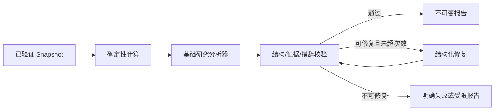
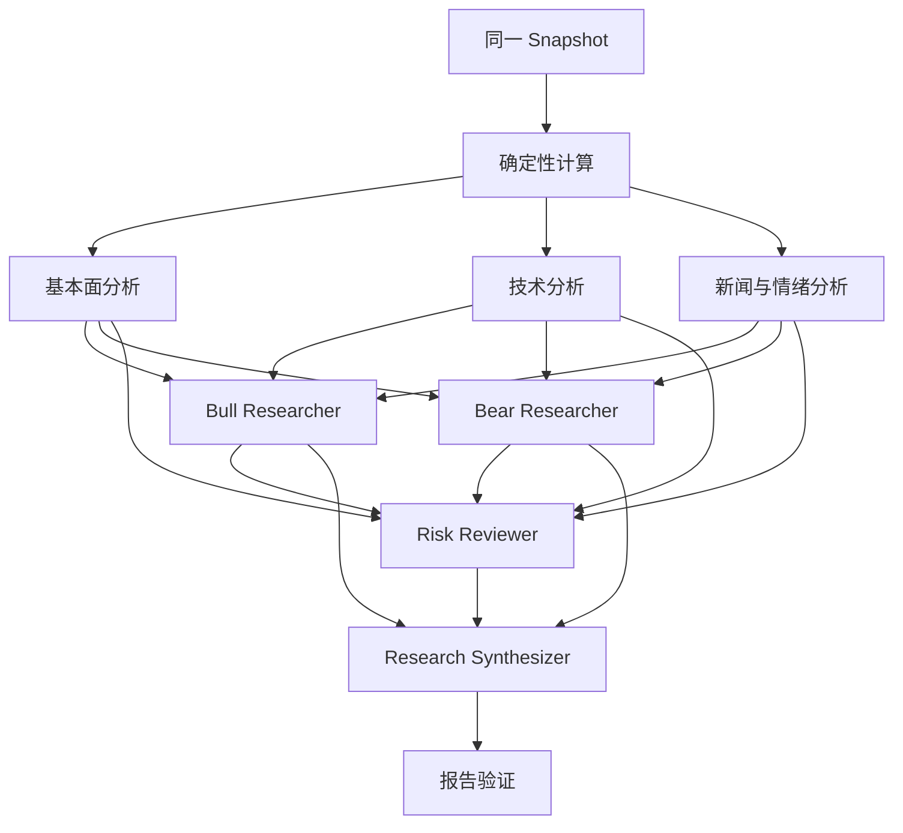

# Agent 工作流规格

状态：提议稿  
版本：0.1  
最后更新：2026-08-09

## 1. 不可变输入原则

工作流唯一事实输入是已持久化并校验的 `ResearchSnapshot`。Agent 接收 snapshot 的只读视图和允许的确定性分析结果，不拥有网络、行情、新闻、文件系统、数据库任意查询或交易工具。任何需要更新数据的情况必须终止当前任务并创建新 snapshot，而不是在运行中补取实时数据。

## 2. 工作流版本

每次运行固定以下元数据：

- snapshot ID、schema version 与 content hash；
- workflow version 与代码 revision；
- 每个角色的 prompt version、locale 和 content hash；
- model provider、model ID、参数、区域和 policy；
- indicator algorithm version、calendar version、data cutoff；
- 报告 schema version 与 validator version。

已发布版本不可原地修改。重试默认复用以上版本；升级版本必须创建新任务。

## 3. BASIC 模式



确定性阶段计算收益率、均线、RSI、MACD、成交量统计、波动率、支撑阻力候选和财务比率。基础研究分析器只解释这些结果和 snapshot 证据，输出市场概况、基本面、技术趋势、新闻（若有）、风险、催化剂和限制。

建议预算：一次主调用，最多一次只针对结构错误的修复调用。修复提示只包含验证错误和原输出，不引入新事实。

## 4. DEEP 模式



前三级分析可并行，但只能读取相同 snapshot 和同一确定性结果。Bull/Bear 读取分析结果及其证据引用；Risk Reviewer 检查所有输出；Synthesizer 生成研究结论，不生成交易指令。

## 5. 角色输出契约

每个角色输出统一 envelope：

```json
{
  "role": "TECHNICAL_ANALYST",
  "status": "COMPLETED",
  "summary": "...",
  "findings": [
    {
      "text": "...",
      "claimType": "INTERPRETATION",
      "snapshotPaths": ["/technicalIndicators/ma20"],
      "sourceIds": ["src_..."],
      "confidence": 0.72
    }
  ],
  "limitations": [],
  "requestedFollowUps": []
}
```

`snapshotPaths` 必须存在。FACT/CALCULATION 引用的 source IDs 必须属于 snapshot。Agent 不得创建新来源 ID。

## 6. 角色责任和禁止事项

| 角色 | 负责 | 不得 |
| --- | --- | --- |
| Fundamental | 财务趋势、盈利质量、债务、估值及缺失项 | 心算指标、臆造同行数据 |
| Technical | 解释已计算指标、完成 bar、趋势和波动 | 自算不透明数值、把形态当确定预测 |
| News | 可靠性、重要性、新颖度、重复、时效和传导 | 把传闻写成事实、越过 cutoff |
| Bull | 最强正面论点、催化剂及证据 | 隐藏反例、保证上涨 |
| Bear | 估值、竞争、监管、周期和论点失效风险 | 夸大低质量来源 |
| Risk | 陈旧/缺失/矛盾、集中度、货币、未来数据和冲突 | 新增未经分析的市场事实 |
| Synthesizer | 合并证据、保留分歧、形成结构化报告 | 称为 Trader Agent、输出下单指令 |

## 7. 确定性计算规则

- 输入 bar 先按时间排序、去重并校验 OHLC 合法性；
- 默认只使用 `isComplete=true` 的 bar，未完成 bar 可展示但不进入收盘指标；
- adjustment policy 在一条序列内必须一致，否则中止相关计算；
- 指标缺少所需观察数时返回 null + limitation，不缩短窗口冒充完整指标；
- 算法对相同输入和版本必须得到相同输出；浮点容差在测试中固定；
- 所有计算输出附算法版本、参数、输入范围和 source IDs；
- 禁止使用 `dataCutoff` 后发布、修订或接收但当时不可得的数据。

## 8. 报告合成与评分

评分不是模型自由生成值。各分项由版本化规则把确定性信号、数据覆盖度和风险标志映射为 0..100 或 null；Synthesizer 只能解释并引用。overall 权重和缺失分项处理由规则版本决定，不把 null 当 0。

confidence 上限受 data quality、来源集中度、冲突数量和关键字段缺失影响。若 data quality 为 INSUFFICIENT，rating 默认 NEUTRAL 或明确无结论，confidence 不得超过预设低上限。

## 9. 验证管线

按顺序执行：

1. JSON 解析与 report schema 校验；
2. report/snapshot instrument、ID、时间和市场阶段一致性；
3. claim ID、source ID、snapshot path 引用完整性；
4. 所有 time-sensitive FACT 至少一个来源且 as-of 不晚于 cutoff；
5. 数字与确定性结果或 provenance value 一致；
6. score/rating/confidence 服从规则版本；
7. 数据限制和 agent disagreements 未被合成器删除；
8. 禁止收益保证、交易执行和越市场概念；
9. PII、秘密和内部 prompt 泄漏扫描；
10. canonicalize、计算 content hash 并持久化。

校验失败分为 `REPAIRABLE_STRUCTURE`、`UNSUPPORTED_CLAIM`、`DATA_MISMATCH`、`POLICY_VIOLATION`、`INTERNAL_ERROR`。只有第一类允许有限模型修复；其他类型不能靠“再问一次模型”绕过。

## 10. 降级和失败策略

- 一个非关键数据域缺失：继续生成受限报告，降低质量并列出 limitation；
- quote 或标的身份不可信：任务失败，不生成伪完整报告；
- DEEP 某分析角色失败：Risk/Synthesizer 只能在显式缺失前提下继续；关键角色阈值由 workflow 配置；
- 模型超时/限流：在任务 deadline 与预算内退避重试或使用已批准 fallback model；
- fallback model 必须记录，不允许改变 schema 或突破数据区域政策；
- worker 崩溃：通过状态 CAS 重领，复用 snapshot 和已完成且 hash 匹配的步骤。

## 11. 论点评估

只有 snapshot 包含确切 thesis version 时执行。分类依据新证据是否支持、削弱或触发用户定义失效条件；每个判断绑定 claim/source。信息不足返回 INSUFFICIENT_DATA，不能默认 UNCHANGED。模型不得修改失效条件或最大可接受损失。

## 12. Prompt 治理

- prompt 只包含完成角色所需的最少上下文；portfolio 信息默认脱敏和裁剪；
- 来源文本视为不可信数据，提示中明确忽略其内嵌指令；
- prompt template、system policy、schema 和示例分别版本化；
- 生产发布需通过固定 golden set、注入攻击、跨市场概念和禁用措辞测试；
- 不保存或展示模型隐式 chain-of-thought，只保留结构化 findings、证据和简洁理由。
